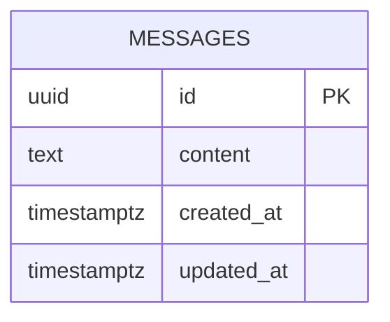

# Database Design (ERD) — hello-word

Engine: PostgreSQL 16
Last updated: 2026-08-20
Source requirements: `docs/hello-word/SRS.md`
Story extension: `docs/hello-word/stories/store-and-serve-message.md`
Reviewed UI mock: `code/frontend/lib/mock/store-and-serve-message.ts`

## 1. Overview

This schema stores one public message row used by backend API and rendered by frontend. Aggregate root is `messages`; no users, permissions, history, navigation, or editing records exist because SRS excludes them.

The reviewed UI mock needs one successful message string and failure states for loading, error, and empty. Loading is frontend-only before HTTP completion. Empty and error map to backend error outcomes. No extra database entity is needed for UI state.

## 2. Diagram

Cardinality notation: no relationships. Single table only.

## 3. Entities

### 3.1 `messages`

**Purpose** — Store current public message text. **Traces to** — HELLO-WORD-001, HELLO-WORD-002.

| Column | Type | Null | Default | Unique | Description |
|---|---|---|---|---|---|
| `id` | `uuid` | no | `gen_random_uuid()` | PK | Surrogate key; constrained to canonical singleton id |
| `content` | `text` | no | none | no | Public message shown as plain text |
| `created_at` | `timestamptz` | no | `now()` |  | Creation time in UTC |
| `updated_at` | `timestamptz` | no | `now()` |  | Last update time in UTC |

**Nullable columns** — none.

**Foreign keys** — none.

**Constraints**

| Name | Type | Rule enforced |
|---|---|---|
| `pk_messages` | primary key | Every row has stable surrogate identity |
| `ck_messages_content_non_empty` | check | `length(btrim(content)) > 0`; rejects blank message |
| `ck_messages_content_single_line` | check | `content !~ '[\r\n]'`; message is one printable line |
| `ck_messages_singleton` | check | `id = '00000000-0000-0000-0000-000000000001'::uuid`; only canonical row id can exist, enforcing one current row by primary key |

**Indexes**

| Name | Columns | Type | Query it serves |
|---|---|---|---|
| `pk_messages` | `id` | unique btree | Backend fetches current message by canonical `id` |

**Lifecycle** — hard delete only. No soft delete because SRS requires exactly one current row and no retention, audit, or personal data.

## 4. Enumerations

None. Message has no status or type field.

## 5. Access patterns

| # | Pattern | Frequency | Index used |
|---|---|---|---|
| 1 | Fetch current message by canonical `id = '00000000-0000-0000-0000-000000000001'` | Every page load/API request | `pk_messages` |

## 6. Data volume and growth

| Table | Rows at launch | Growth | Retention |
|---|---|---|---|
| `messages` | 1 | 0/month under current scope | Retain until replaced or product removed |

No table approaches 10M rows. No partitioning or archive needed.

## 7. Integrity, privacy, and security

- Database enforces canonical singleton row id, non-empty content, and single-line content.
- Application seeds canonical row with `Hello Word` on startup if missing, then serves it as plain text.
- Application handles missing row as empty-data error if seed failed or row was removed; frontend must not show fallback copy.
- No personal data, secrets, or row-level access rules exist. Message is public.

## 8. Migrations

| # | Change | Forward | Backward | Safe on non-empty table |
|---|---|---|---|---|
| 1 | Initial message schema | `CREATE EXTENSION IF NOT EXISTS pgcrypto; CREATE TABLE IF NOT EXISTS messages (id uuid PRIMARY KEY DEFAULT gen_random_uuid(), content text NOT NULL, created_at timestamptz NOT NULL DEFAULT now(), updated_at timestamptz NOT NULL DEFAULT now(), CONSTRAINT ck_messages_content_non_empty CHECK (length(btrim(content)) > 0), CONSTRAINT ck_messages_content_single_line CHECK (content !~ '[\r\n]'), CONSTRAINT ck_messages_singleton CHECK (id = '00000000-0000-0000-0000-000000000001'::uuid)); INSERT INTO messages (id, content) VALUES ('00000000-0000-0000-0000-000000000001', 'Hello Word') ON CONFLICT (id) DO NOTHING;` | `DROP TABLE IF EXISTS messages;` | yes when table absent; seed is idempotent; not safe to apply over an existing differently-shaped `messages` table without manual review |

No irreversible migration. Future change to more than one message must first drop `ck_messages_singleton` in separate migration and define selection rule.

## 9. Open questions

| Question | Owner | Blocking |
|---|---|---|
| none | PM / stakeholder | no |
