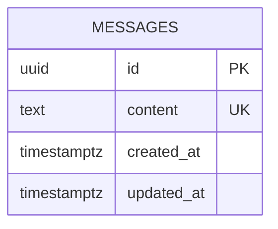

# Database Design (ERD) — hello-word

Engine: PostgreSQL 16
Last updated: 2026-08-20
Source requirements: `docs/hello-word/SRS.md`

## 1. Overview

This schema stores one public message row used by backend API and rendered by frontend. Aggregate root is `messages`; no users, permissions, history, navigation, or editing records exist because SRS excludes them.

## 2. Diagram



Cardinality notation: no relationships. Single table only.

## 3. Entities

### 3.1 `messages`

**Purpose** — Store current public message text. **Traces to** — HELLO-WORD-001, HELLO-WORD-002.

| Column | Type | Null | Default | Unique | Description |
|---|---|---|---|---|---|
| `id` | `uuid` | no | `gen_random_uuid()` | PK | Surrogate key |
| `content` | `text` | no | none | via `ck_messages_singleton` design plus one seeded row, not per-column | Public message shown as plain text |
| `created_at` | `timestamptz` | no | `now()` |  | Creation time in UTC |
| `updated_at` | `timestamptz` | no | `now()` |  | Last update time in UTC |

**Nullable columns** — none.

**Foreign keys** — none.

**Constraints**

| Name | Type | Rule enforced |
|---|---|---|
| `pk_messages` | primary key | Every row has stable surrogate identity |
| `ck_messages_content_non_empty` | check | `length(btrim(content)) > 0`; rejects blank message |
| `ck_messages_content_single_line` | check | `content !~ '[\r\n]'`; message is one printable line |
| `ck_messages_singleton` | check | `id = '00000000-0000-0000-0000-000000000001'::uuid`; only canonical row id can exist, enforcing exactly one current row with primary key |

**Indexes**

| Name | Columns | Type | Query it serves |
|---|---|---|---|
| `pk_messages` | `id` | unique btree | Backend fetches current message by canonical `id` |

**Lifecycle** — hard delete only. No soft delete because SRS requires exactly one current row and no retention, audit, or personal data.

## 4. Enumerations

None. Message has no status or type field.

## 5. Access patterns

| # | Pattern | Frequency | Index used |
|---|---|---|---|
| 1 | Fetch current message by canonical `id = '00000000-0000-0000-0000-000000000001'` | Every page load/API request | `pk_messages` |

## 6. Data volume and growth

| Table | Rows at launch | Growth | Retention |
|---|---|---|---|
| `messages` | 1 | 0/month under current scope | Retain until replaced or product removed |

No table approaches 10M rows. No partitioning or archive needed.

## 7. Integrity, privacy, and security

- Database enforces one canonical row, non-empty content, and single-line content.
- Application seeds canonical row with `Hello Word` on startup if missing, then serves it as plain text.
- Application handles missing row as empty-data error if seed failed; frontend must not show fallback copy.
- No personal data, secrets, or row-level access rules exist. Message is public.

## 8. Migrations

| # | Change | Forward | Backward | Safe on non-empty table |
|---|---|---|---|---|
| 1 | Initial message schema | `CREATE EXTENSION IF NOT EXISTS pgcrypto; CREATE TABLE messages (...); INSERT INTO messages (id, content) VALUES ('00000000-0000-0000-0000-000000000001', 'Hello Word') ON CONFLICT (id) DO NOTHING;` | `DROP TABLE IF EXISTS messages;` | yes for empty DB; on populated DB, `CREATE TABLE` is safe if table absent, seed is idempotent |
| 2 | Render centered message story | No database change. Reuse `messages.content` as source for frontend `message` string. | No rollback needed beyond removing consuming frontend/backend code. | yes; no DDL or data mutation |

No irreversible migration. Future change to more than one message must first drop `ck_messages_singleton` in separate migration and define selection rule.

## 9. Story extensions

### 9.1 Render centered message

Reviewed UI mock contract:

```ts
export type MessageResponse =
  | { state: 'loading' }
  | { state: 'error'; error: { code: 'INTERNAL'; message: string } }
  | { state: 'empty' }
  | { state: 'success'; message: string };
```

Schema impact: none. `MessageResponse.success.message` maps to `messages.content`; `empty` maps to missing canonical row or invalid empty content; `error` maps to backend error catalog; `loading` is frontend-only state before API settles.

## 10. Open questions

| Question | Owner | Blocking |
|---|---|---|
| none | PM / stakeholder | no |
