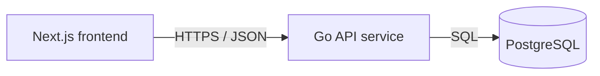

# Service & Interface Design — hello-word

Last updated: 2026-08-20
Source: `docs/hello-word/SRS.md`, `docs/architecture/erd.md`, `docs/architecture/overview.md`
Story extension: `docs/hello-word/stories/store-and-serve-message.md`
Reviewed UI mock: `code/frontend/lib/mock/store-and-serve-message.ts`

## 1. Service map



| Service | Responsibility | Owns (tables) | Depends on | Deploy unit |
|---|---|---|---|---|
| Go API service | Serve public message API, apply migrations, seed canonical message row, expose health | `messages`, `schema_migrations` | PostgreSQL | backend container |
| Next.js frontend | Render single public page from backend response | none | Go API service | frontend container |

**Why these boundaries** — single backend service: no extra service boundary justified yet. Frontend and backend differ by runtime and deploy unit; database is persistence, not service owner.

## 2. Cross-cutting contract

### 2.1 Base

- Base URL: `{scheme}://{host}/api/v1`
- Content type: `application/json; charset=utf-8`
- Versioning: URL path major version. New major version only for breaking changes.
- Trace header: `X-Request-Id` accepted from caller, generated if absent, echoed on every response and present in every log line.

### 2.2 Authentication and authorization

| Aspect | Decision |
|---|---|
| Mechanism | none; page and message API are public |
| Token lifetime | not applicable |
| Refresh | not applicable |
| Transport | no `Authorization` header required or used |
| Roles | public visitor only |
| Enforcement point | HTTP middleware verifies no auth is required; handlers do not branch on identity |

### 2.3 Error contract

Every non-2xx JSON response from `/api/v1/*` has this shape:

```json
{
  "error": {
    "code": "INTERNAL",
    "message": "Human-readable summary, safe to show a user.",
    "details": [],
    "request_id": "01HX..."
  }
}
```

Consumers branch on `code`. `message` may change without contract notice. `details` is empty when no field-level validation error exists.

The reviewed UI mock accepts success payload `{ "message": string }` and error outcomes with `error.code` values `INTERNAL`, `UNAVAILABLE`, and `NOT_FOUND`; backend also returns `VALIDATION_FAILED` for corrupt stored content. Frontend BE integration must map any API error into UI state `error`, and map `NOT_FOUND` to UI state `empty` if it wants current empty UI branch.

**Error catalog** — closed set for this project.

| Code | HTTP | Meaning | Retryable |
|---|---|---|---|
| `VALIDATION_FAILED` | 422 | Stored message content violates boundary rule during seed/read validation | no |
| `NOT_FOUND` | 404 | Canonical message row is absent after startup seeding failed or was removed | no |
| `INTERNAL` | 500 | Unexpected failure; details are logged, not returned | yes |
| `UNAVAILABLE` | 503 | PostgreSQL unavailable, migrations not ready, or service shutting down | yes |

### 2.4 Pagination

No list endpoints exist. If future collections are added, use cursor pagination with stable unique sort per `references/api-conventions.md`.

| Aspect | Decision |
|---|---|
| Style | none now; cursor for future growing collections |
| Default limit | not applicable |
| Max limit | not applicable |
| Default sort | not applicable |

### 2.5 Validation boundary

Validation boundary is Go HTTP handler layer for request metadata plus repository read/seed boundary for database-derived message content. External HTTP input has no path/query/body fields on current endpoints. Message content read from PostgreSQL must be validated before response: non-empty after trim and no `\r` or `\n`. Downstream response rendering may trust validated value and must escape it as plain text.

### 2.6 Idempotency

No public write endpoints exist. Startup seed is idempotent by canonical primary key `00000000-0000-0000-0000-000000000001` and `ON CONFLICT DO NOTHING`. No `Idempotency-Key` header is accepted.

## 3. Endpoints

### 3.1 `GET /api/v1/message`

**Purpose** — Return current public message text. **Traces to** — HELLO-WORD-001, HELLO-WORD-002. **Auth** — public, no credentials.

**Path / query parameters**

| Name | In | Type | Required | Constraints | Description |
|---|---|---|---|---|---|
| none | n/a | n/a | n/a | n/a | Endpoint accepts no path or query parameters |

**Request body**

No request body. Requests with body content are ignored; clients must not send one.

```json
{}
```

| Field | Type | Required | Constraints | Description |
|---|---|---|---|---|
| none | n/a | n/a | n/a | No request fields |

**Success response** — `200`

```json
{
  "message": "Hello Word"
}
```

| Field | Type | Nullable | Description |
|---|---|---|---|
| `message` | string | no | Current stored message content, one printable non-empty line, served unchanged as plain text |

**Mock alignment** — Reviewed UI mock `MessageApiResponse` is exactly `{ "message": string }`. Service intentionally omits a `state` success discriminator because frontend state is local UI state, not API data.

**Errors** — every code this endpoint can return. No others.

| Code | HTTP | Trigger | Frontend mock state |
|---|---|---|---|
| `VALIDATION_FAILED` | 422 | Stored `messages.content` is empty, blank, or contains newline despite database constraint | `error` |
| `NOT_FOUND` | 404 | Canonical `messages` row is missing | `empty` |
| `UNAVAILABLE` | 503 | PostgreSQL query fails due to unavailable dependency, timeout, or service draining | `error` |
| `INTERNAL` | 500 | Unexpected server failure not classified above | `error` |

**Notes** — Safe and idempotent read. No side effects. Backend query timeout: 2 seconds. No retry inside request handler; frontend may retry on user/page refresh only. Frontend failure behavior: show no stale or fallback message. Reviewed mock uses local `loading`, `empty`, and `error` UI states; backend does not emit `loading` because loading exists only before HTTP response.

### 3.2 `GET /healthz`

**Purpose** — Report backend readiness for runtime health checks. **Traces to** — architecture overview backend contract, supports HELLO-WORD-001 availability. **Auth** — public, no credentials.

**Path / query parameters**

| Name | In | Type | Required | Constraints | Description |
|---|---|---|---|---|---|
| none | n/a | n/a | n/a | n/a | Endpoint accepts no path or query parameters |

**Request body**

No request body.

```json
{}
```

| Field | Type | Required | Constraints | Description |
|---|---|---|---|---|
| none | n/a | n/a | n/a | No request fields |

**Success response** — `200`

```json
{
  "status": "ok"
}
```

| Field | Type | Nullable | Description |
|---|---|---|
| `status` | string enum `ok` | no | Service ready; migrations have succeeded and `SELECT 1` works |

**Errors** — every code this endpoint can return. No others.

| Code | HTTP | Trigger |
|---|---|---|
| `UNAVAILABLE` | 503 | Migrations failed, PostgreSQL check fails, timeout occurs, or service draining |
| `INTERNAL` | 500 | Unexpected server failure not classified above |

**Notes** — Outside `/api/v1` so load balancers can call stable health path. Same error shape as API endpoints when JSON is returned. Backend health DB timeout: 1 second. No retries; orchestrator/container restarts decide recovery.

## 4. Asynchronous work

None.

| Name | Trigger | Payload | Retry | Backoff | Dead letter | Idempotent |
|---|---|---|---|---|---|---|
| none | n/a | n/a | n/a | n/a | n/a | n/a |

## 5. External integrations

No third-party systems. Only internal SQL dependency exists.

| System | Purpose | Protocol | Timeout | Retry | On failure | Secrets |
|---|---|---|---|---|---|---|
| PostgreSQL | Store and read canonical message row | SQL over database driver | 2s for message read/seed; 1s for health check | no per-request retry; startup may fail fast and container restarts | `/api/v1/message` returns `UNAVAILABLE`; frontend shows no stale/fallback message; `/healthz` returns 503 | `DATABASE_URL` environment variable listed in `code/backend/.env.example` |

## 6. Non-functional targets

| Aspect | Target |
|---|---|
| p95 latency (read) | `GET /api/v1/message` under 200 ms from backend after warm start on local/container network |
| p95 latency (write) | no public write endpoints |
| Availability | health returns 200 only after DB and migrations ready |
| Rate limit | none at app layer for single public read; infrastructure may rate-limit abuse |
| Payload cap | inbound request body cap 1 MiB globally; current endpoints require no body |
| Timeout (inbound) | 5 seconds per HTTP request |

## 7. Observability

- Log fields on every request line: `request_id`, method, path, status, duration_ms, remote_addr, user_agent.
- Metrics per endpoint when metrics sink exists: request count, error count by code/status, duration histogram.
- Never log secrets, `DATABASE_URL`, full request bodies, stack traces in responses, or personal data. Project stores no personal data.

## 8. Contract evolution

| Change | Additive or breaking | Migration path |
|---|---|---|
| Add optional response field to `GET /api/v1/message` | additive | frontend ignores unknown fields |
| Add new endpoint under `/api/v1` | additive | no migration needed |
| Rename `state` or `message` field, change its type, or wrap response | breaking | add `/api/v2/message`, migrate frontend, then deprecate v1 with `Deprecation` header |
| Add auth to `GET /api/v1/message` | breaking | create protected v2 endpoint or keep public v1 until replacement deployed |
| Allow multiple messages | breaking for data and API semantics | revise SRS/ERD, add selection contract, migrate data after frontend understands new shape |

## 9. Migration plan

| Step | Forward | Backward | Safe on populated tables |
|---|---|---|---|
| 1 | Create `messages` table and constraints from ERD; seed canonical row `Hello Word` with `ON CONFLICT DO NOTHING` | Drop `messages` table | Safe when table absent; not safe over existing differently-shaped `messages` table without manual review |
| 2 | Add backend contract `GET /api/v1/message` returning `{ "state": "ready", "message": string }` | Remove endpoint before frontend depends on real API; after frontend integration, rollback frontend first | yes; read-only endpoint |
| 3 | Add `GET /healthz` readiness check | Remove health route only if deployment health probe changes first | yes; read-only endpoint |

No irreversible service migration.

## 10. Open questions

| Question | Owner | Blocking |
|---|---|---|
| none | PM / stakeholder | no |

## 11. Requirement traceability

| Requirement | Endpoint(s) | Coverage |
|---|---|---|
| HELLO-WORD-001 | `GET /api/v1/message`, `GET /healthz` | Stored row read from PostgreSQL, canonical seed/read failure states, backend readiness |
| HELLO-WORD-002 | `GET /api/v1/message` | Frontend receives backend-provided plain text; UI states avoid fallback/stale copy on API failure |
